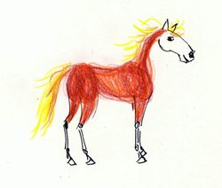
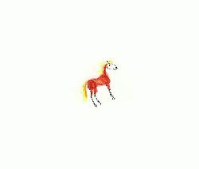
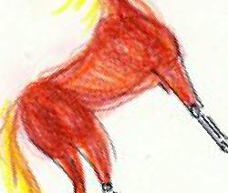
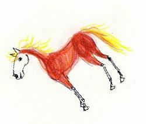
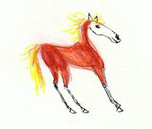
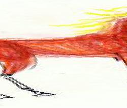
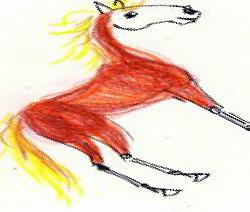

# Image-Transform
Applies matrix transformations to an image

-h, --help            show this help message and exit

  -i INPUTFILE, --inputfile INPUTFILE
                        Image file to be transformed
                        
  -o OUTPUTFILE, --outputfile OUTPUTFILE
                        name of the outputfile
                        
  -sc SCALE, --scale SCALE
                        scales the image horizontally and vertically by the
                        factor
                        
  -sch SCALEHORIZONTALLY, --scaleHorizontally SCALEHORIZONTALLY
                        scales the image horizontally by the factor
                        
  -scv SCALEVERTICALLY, --scaleVertically SCALEVERTICALLY
                        scales the image vertically by the factor
                        
  -shh SHEARHORIZONTALLY, --shearHorizontally SHEARHORIZONTALLY
                        shears the image horizontally by the factor
                        
  -shv SHEARVERTICALLY, --shearVertically SHEARVERTICALLY
                        shears the image vertically by the factor
                        
  -r ROTATE, --rotate ROTATE
                        Rotates the image by angle
                        
  -m MIRROR, --mirror MIRROR
                        Mirrors along the mirror axis defined by its angle
                        
# Examples

-r 20 -sc .3

-r 40 -sc 2

-m 40

-shh -0.5

-r 10 -sch 4

-r 45
